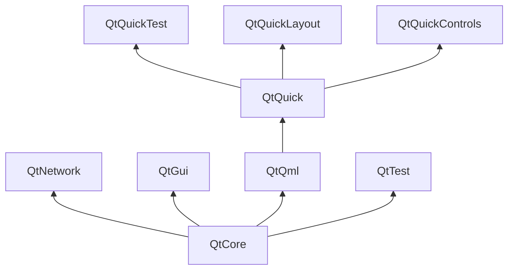

# Qt Building Blocks(Qt 构件)

Qt 6 consists of a large number of modules. In general, a module is a library for the developer to use. Some modules are mandatory for a Qt-enabled platform and form the set called *Qt Essentials Modules*. Other modules are optional, and form the *Qt Add-On Modules*. The majority of developers may not need to use the latter, but it’s good to know about them as they provide invaluable solutions to common challenges.

Qt 6 包含大量模块。一般来说，模块是供开发人员使用的库。有些模块是启用 Qt 的平台必须使用的，它们组成了 *Qt Essentials Modules*（Qt 基本模块）。其他模块是可选的，它们构成了 *Qt 附加模块*。大多数开发人员可能不需要使用后一种模块，但了解这些模块是有好处的，因为它们为常见问题提供了宝贵的解决方案。

## Qt Modules(Qt 模块)

The Qt Essentials modules are mandatory for any Qt-enabled platform. They offer the foundation to develop modern Qt 6 Applications using Qt Quick 2. The full list of modules is available in the [Qt documentation module list](https://doc.qt.io/qt-6/qtmodules.html#qt-essentials).

Qt Essentials 模块是任何支持 Qt 的平台的必备模块。它们为使用 Qt Quick 2 开发现代 Qt 6 应用程序奠定了基础。模块的完整列表见 [Qt 文档模块列表](https://doc.qt.io/qt-6/qtmodules.html#qt-essentials)。

## Core-Essential Modules(核心基本模块)

The minimal set of Qt 6 modules to start QML programming.

开始 QML 编程所需的 Qt 6 最小模块集。

* **Qt Core** - Core non-graphical classes used by other modules.
* **Qt Core** - 其他模块使用的核心非图形类。
* **Qt D-BUS** - Classes for inter-process communication over the D-Bus protocol on linux.
* **Qt D-BUS** - 用于在 linux 上通过 D-Bus 协议进行进程间通信的类。
* **Qt GUI** - Base classes for graphical user interface (GUI) components. Includes OpenGL.
* **Qt GUI** - 图形用户界面（GUI）组件的基础类。包括 OpenGL。
* **Qt Network** - Classes to make network programming easier and more portable.
* **Qt Network** - 使网络编程更简单、更可移植的类。
* **Qt QML** - Classes for QML and JavaScript languages.
* **Qt QML** - 用于 QML 和 JavaScript 语言的类。
* **Qt Quick** - A declarative framework for building highly dynamic applications with custom user interfaces.
* **Qt Quick** - 用于构建具有自定义用户界面的高动态应用程序的声明式框架。
* **Qt Quick Controls** - Provides lightweight QML types for creating performant user interfaces for desktop, embedded, and mobile devices. These types employ a simple styling architecture and are very efficient.
* **Qt Quick Controls** - 为创建桌面、嵌入式和移动设备的高性能用户界面提供轻量级 QML 类型。这些类型采用简单的样式架构，非常高效。
* **Qt Quick Layouts** - Layouts are items that are used to arrange Qt Quick 2 based items in the user interface.
* **Qt Quick Layouts** - Layouts 是用于在用户界面中排列基于 Qt Quick 2 项目的项目。
* **Qt Quick Test** - A unit test framework for QML applications, where the test cases are written as JavaScript functions.
* **Qt Quick Test** - 用于 QML 应用程序的单元测试框架，测试用例编写为 JavaScript 函数。
* **Qt Test** - Classes for unit testing Qt applications and libraries.
* **Qt Test** - 用于对 Qt 应用程序和库进行单元测试的类。
* **Qt Widgets** - Classes to extend Qt GUI with C++ widgets.
* **Qt Widgets** - 用 C++ 小工具扩展 Qt GUI 的类。

## Qt Add-On Modules(Qt 附加模块)

Besides the essential modules, Qt offers additional modules that target specific purposes. Many add-on modules are either feature-complete and exist for backwards compatibility, or are only applicable to certain platforms. Here is a list of some of the available add-on modules, but make sure you familiarize yourself with them all in the [Qt documentation add-ons list](https://doc.qt.io/qt-6/qtmodules.html#qt-add-ons) and in the list below.

除基本模块外，Qt 还提供针对特定用途的附加模块。许多附加模块要么功能完备、向后兼容，要么只适用于某些平台。下面列出了一些可用的附加模块，但请务必在[Qt 文档附加模块列表](https://doc.qt.io/qt-6/qtmodules.html#qt-add-ons)和下面的列表中熟悉所有这些模块。

* **Network**: Qt Bluetooth / Qt Network Authorization
* **Network**:  Qt 蓝牙/Qt 网络授权
* **UI Components**: Qt Quick 3D / Qt Quick Timeline / Qt Charts / Qt Data Visualization / Qt Lottie Animation / Qt Virtual Keyboard
* **UI Components**: Qt Quick 3D / Qt Quick Timeline / Qt Charts / Qt 数据可视化 / Qt Lottie 动画 / Qt 虚拟键盘
* **Graphics**: Qt 3D / Qt Image Formats / Qt OpenGL / Qt Shader Tools / Qt SVG / Qt Wayland Compositor
* **Graphics**: Qt 3D / Qt 图像格式 / Qt OpenGL / Qt 着色工具 / Qt SVG / Qt Wayland 合成器
* **Helper**: Qt 5 Core Compatibility APIs / Qt Concurrent / Qt Help / Qt Print Support / Qt Quick Widgets / Qt SCXML / Qt SQL / Qt State Machine / Qt UI Tools / Qt XML
* **Helper**: Qt 5 Core Compatibility APIs / Qt Concurrent / Qt Help / Qt Print Support / Qt Quick Widgets / Qt SCXML / Qt SQL / Qt State Machine / Qt UI Tools / Qt XML

::: tip
As these modules are not part of the release, the state of each module may differ depending on how many contributors are active and how well it’s tested.

这些模块不是发行版的一部分，每个模块的状态可能会有所不同，这取决于有多少贡献者在积极贡献，以及测试得如何。
:::

## Supported Platforms(支持的平台)

Qt supports a variety of platforms including all major desktop and embedded platforms. Through the Qt Platform Abstraction, it’s now easier than ever to port Qt to your own platform if required.

Qt 支持各种平台，包括所有主要的桌面和嵌入式平台。通过 Qt 平台抽象，现在比以往任何时候都更容易在需要时将 Qt 移植到自己的平台上。

Testing Qt 6 on a platform is time-consuming. A subset of platforms was selected by the Qt Project to build the reference platforms set. These platforms are thoroughly tested through the system testing to ensure the best quality. However, keep in mind that no code is error-free.

在平台上测试 Qt 6 非常耗时。Qt 项目选择了一部分平台来构建参考平台集。这些平台通过系统测试进行了全面测试，以确保最佳质量。不过，请记住没有代码是没有错误的。

# Qt Project(Qt 项目)

From the [Qt Wiki](http://wiki.qt.io/):
摘自 [Qt Wiki](http://wiki.qt.io/)：

> “The Qt Wiki is a meritocratic consensus-based community interested in Qt. Anyone who shares that interest can join the community, participate in its decision-making processes, and contribute to Qt’s development. 
Qt Wiki 是一个对 Qt 感兴趣的民主共识社区。任何对此感兴趣的人都可以加入该社区，参与其决策过程，并为 Qt 的开发做出贡献
”

The Qt Wiki is a place where Qt users and contributors share their insights. It forms the base for other users to contribute. The biggest contributor is The Qt Company, which holds also the commercial rights to Qt.

Qt Wiki 是 Qt 用户和贡献者分享见解的地方。它是其他用户作出贡献的基础。最大的贡献者是 Qt 公司，该公司还拥有 Qt 的商业版权。

Qt has an open-source aspect and a commercial aspect for companies. The commercial aspect is for companies which can not or will not comply with the open-source licenses. Without the commercial aspect, these companies would not be able to use Qt and it would not allow The Qt Company to contribute so much code to the Qt Project.

Qt 有面向公司的开源部分和商业部分。商业方面是针对那些不能或不愿遵守开源许可证的公司。如果没有商业方面，这些公司将无法使用 Qt，Qt 公司也无法为 Qt 项目贡献如此多的代码。

There are many companies worldwide, which make the living out of consultancy and product development using Qt on the various platforms. There are many open-source projects and open-source developers, which rely on Qt as their major development library. It feels good to be part of this vibrant community and to work with this awesome tools and libraries. Does it make you a better person? Maybe:-)

全球有许多公司通过在各种平台上使用 Qt 进行咨询和产品开发谋生。许多开源项目和开源开发人员都依赖 Qt 作为他们的主要开发库。能成为这个充满活力的社区的一员，并使用这些出色的工具和库，感觉非常好。这会让你成为一个更好的人吗？也许吧：-)

**Contribute here: http://wiki.qt.io/**
**在此投稿：http://wiki.qt.io/**
